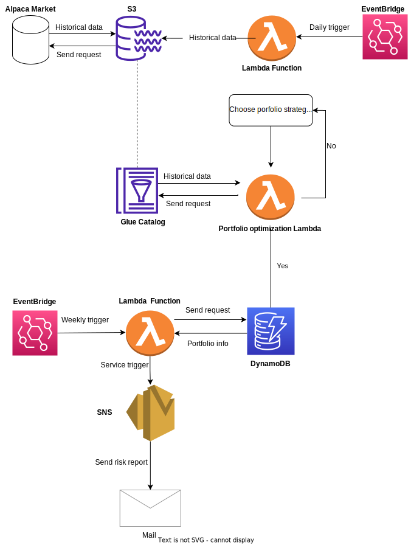

# Stock Portfolio Management System:
* Automatically update daily price data of nasdaq stocks to data lake (S3)
* Invoke Lambda Function to return porfolio allocation based on subcriber's optimization method  
* Automatically distribute risk analysis report of portfolios to subcribers with SNS

# Infrastructure of the system
* 1 Data lake service (S3) to store historical price data of nasdaq stocks (in parquet format)
* 1 Lambda Function triggered by EventBridge to request stock data from Alpaca  and put in S3
* 1 Glue Catalog table to store meta data of S3 objects 
* 1 Lambda Function to run batch job for portfolio optimization
* 1 DynamoDB as a key-value database to store portfolio meta data of subscriber
* 1 Lamda Function trigger by EventBridge to create risk analysis report
* 1 SNS to distribute risk analysis report of portfolios to subscriber

# Future Improvement
* Adding more optimization methods to lambda function
* Adding more timeframe for nasdaq stock data

